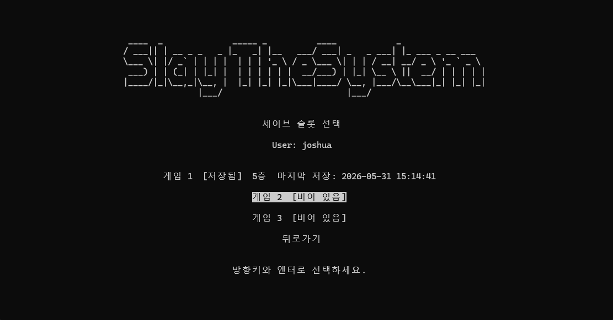
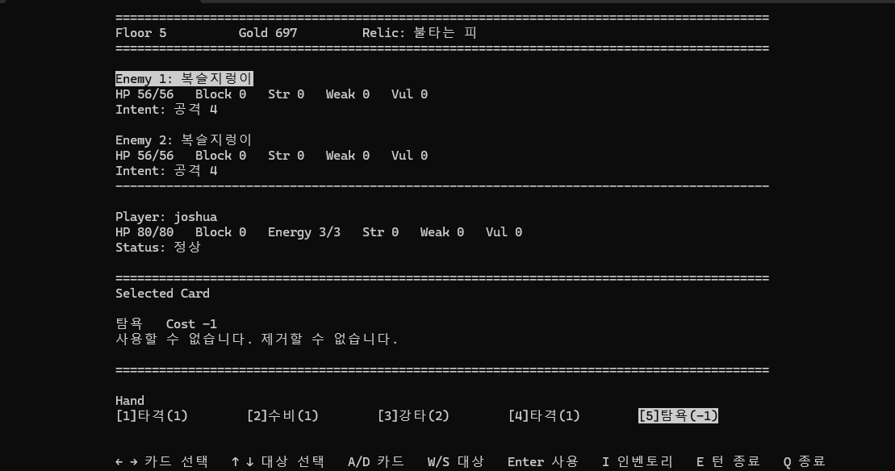
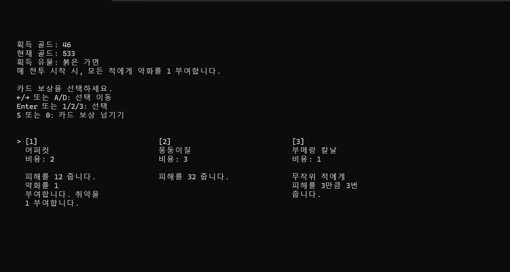
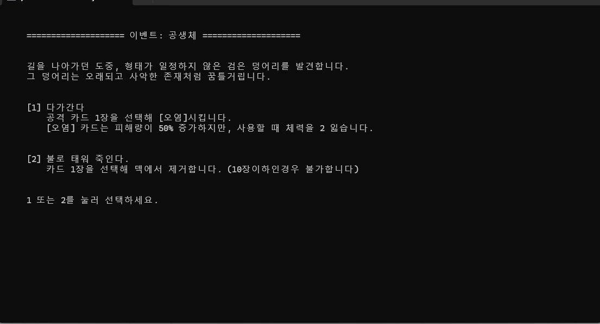
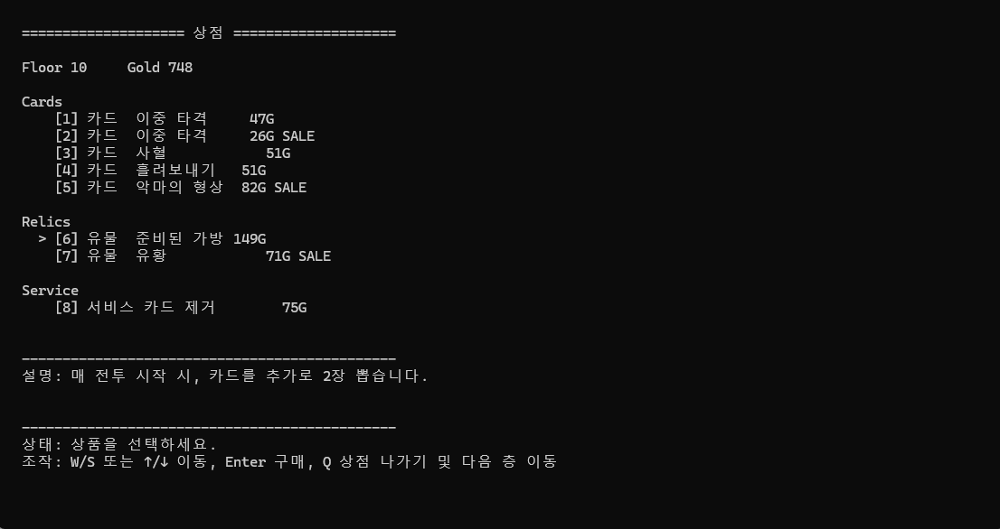
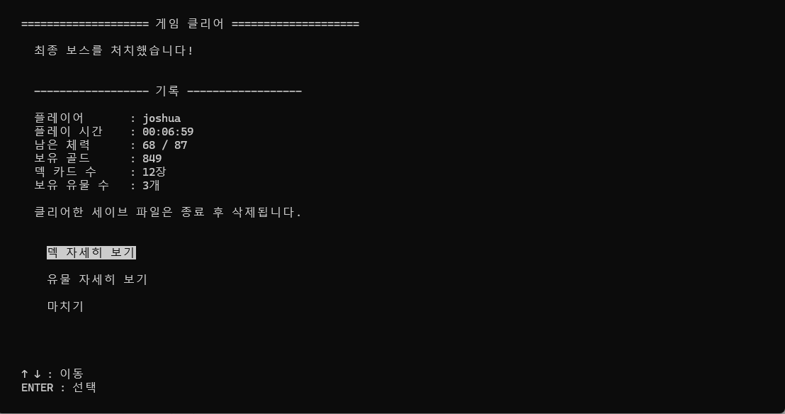

# 🎮 slay-the-system

> 2026년 1학기 시스템프로그래밍 팀프로젝트

## 프로젝트 소개

**slay-the-system**은 C 언어와 ncurses 라이브러리를 이용하여 구현한 터미널 기반 카드 로그라이크 게임입니다.

플레이어는 다양한 카드를 활용하여 적과 전투를 진행하고, 전투를 통해 획득한 카드와 유물로 덱을 강화하며 최종 보스를 처치하는 것을 목표로 합니다.

게임은 총 15층으로 구성되어 있으며, 전투, 이벤트, 상점, 휴식, 보물방 등 다양한 스테이지를 탐험할 수 있습니다.

---

## 개발 기간

* 2026.05.07 ~ 2026.05.31

---

## 팀원

- 허준렬 (GitHub: joshuaheo)
- 서인원 (GitHub: dragondragon1118)
---

## 개발 환경

| 항목    | 내용           |
| ----- | ------------ |
| 운영체제  | Ubuntu 24.04 |
| 언어    | C            |
| 컴파일러  | GCC          |
| 라이브러리 | ncursesw     |

---

## 필요 패키지 설치

빌드 전 다음 패키지를 설치해야 합니다.

```bash
sudo apt update
sudo apt install gcc make libncursesw5-dev
```

---

## 빌드

프로젝트 루트 디렉터리에서 다음 명령어를 실행합니다.

```bash
make
```

빌드가 완료되면 실행 파일이 생성됩니다.

```text
build/game
```

---

## 실행

```bash
./build/game
```

---

## 정리

빌드 결과물을 삭제합니다.

```bash
make clean
```

---

## 게임 진행 방식

플레이어는 15층으로 구성된 맵을 탐험하며 다양한 스테이지를 선택하게 됩니다.

일반 전투와 정예 전투를 통해 카드와 유물을 획득할 수 있으며, 이벤트와 상점을 활용하여 덱을 강화할 수 있습니다.

최종적으로 15층의 보스를 처치하면 게임이 클리어됩니다.

---

## 스테이지 구성

게임은 총 15층으로 구성되어 있으며, 일부 층에서는 두 가지 스테이지 중 하나를 선택할 수 있습니다.

| 층 | 스테이지 |
|----|----------|
| 1 | 일반 전투 |
| 2 | 이벤트 / 일반 전투 |
| 3 | 일반 전투 |
| 4 | 상점 / 일반 전투 |
| 5 | 일반 전투 / 이벤트 |
| 6 | 일반 전투 / 휴식 |
| 7 | 정예 전투 / 이벤트 |
| 8 | 일반 전투 |
| 9 | 보물방 |
| 10 | 상점 / 일반 전투 |
| 11 | 일반 전투 / 휴식 |
| 12 | 정예 전투 / 일반 전투 |
| 13 | 일반 전투 |
| 14 | 휴식 |
| 15 | 최종 보스 |

## 주요 기능

### ⚔️ 카드 기반 전투

* 랜덤한 조합으로 출현하는 적 조합
* 턴제 카드 전투 시스템
* 다중 적 전투 지원
* 적 행동 패턴 시스템
* 방어도, 취약, 힘 등의 버프/디버프 시스템
* 적 등급에 따른 보상 분리

### 🃏 덱 빌딩

* 카드 획득 및 제거
* 취약, 소멸, 힘, 방어도, 다단 공격 등 다양한 카드 메커니즘
* 카드 희귀도 시스템
* 특정 조건 충족 시 발동되는 특수 카드 구현

### 🏺 유물 시스템

* 유물 희귀도 시스템
* 전투 시작 시, 턴 시작 시 등 여러 시점에 발동하는 유물 

### 🏪 다양한 스테이지

* 일반 전투
* 정예 전투
* 보스 전투
* 이벤트
* 상점
* 휴식
* 보물방

### 💾 저장 시스템

* 계정 생성 및 로그인
* 다중 세이브 슬롯 지원
* 자동 저장 기능
* 이어하기 기능
* 슬롯 별 플레이 시간 저장

---

## 구현 규모

| 항목           | 개수  |
| ------------ | --- |
| 일반 카드        | 32종 |
| 상태 카드        | 3종  |
| 유물           | 21종 |
| 이벤트          | 5종  |
| 일반 적         | 10종 |
| 정예 적         | 3종  |
| 보스           | 1종  |
| 3층까지의 적 조합   | 6종  |
| 4층 이후의 적 조합  | 14종 |
| 최대 동시 등장 적 수 | 3마리 |

초반 덱이 약한 점을 고려하여 3층까지와 4층 이후의 적 조합을 분리하였습니다.

---

## 시스템 프로그래밍 요소

본 프로젝트는 시스템프로그래밍 과목에서 학습한 개념을 활용하여 구현되었습니다.

### 파일 시스템 활용

- `open()`, `read()`, `write()`, `close()`를 이용한 세이브 데이터 저장 및 로드
- `access()`로 `saves/` 디렉터리 존재 여부를 확인하고, 없을 경우 `mkdir()`로 생성
- `unlink()`를 이용한 세이브 파일 삭제
- `stat()`을 이용한 마지막 저장 시간 조회

### 시그널 처리

- SIGINT(Ctrl+C) 수신 시 안전 종료 플래그 설정
- 전투 중 즉시 종료 대신 안전한 시점에서 프로그램 종료

### 터미널 기반 UI

* ncursesw 라이브러리를 이용한 인터페이스 구현
* 키보드 입력 처리
* 카드 적용에 따른 적 체력 및 에너지 실시간 반영 구현

---

## 실행 화면

### 시작화면


### 전투화면(노멀 등급 적)


### 보상화면(엘리트)


### 이벤트화면(공생체)


### 상점화면


### 최종보스 클리어 화면

